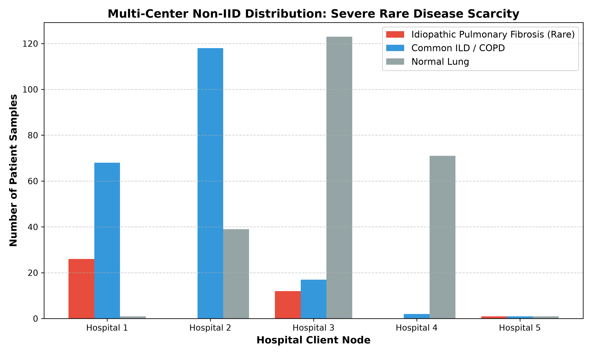
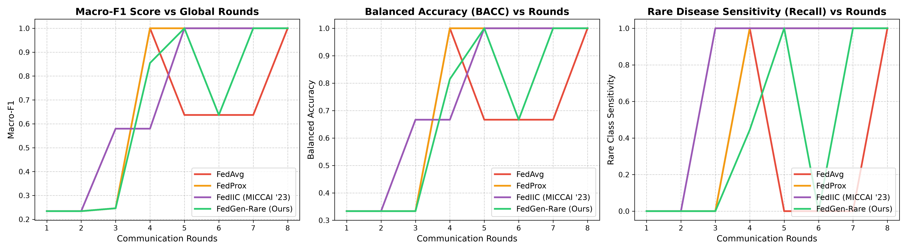
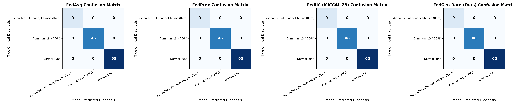

# FedGen-Rare: Privacy-Preserving Federated Generative Replay for Rare Disease Diagnosis

[](https://www.python.org/)
[](https://pytorch.org/)
[](https://github.com/wnn2000/FedIIC)
[]()
[]()

> **Senior Design Project (SDP) – Review 1**  
> **Project Title:** Privacy-Preserving Federated Generative Replay for Rare Disease Diagnosis  
> **Target Clinical Pathology:** Idiopathic Pulmonary Fibrosis (IPF, Orphanet ID: ORPHA:2032)  
> **Project Guide:** Prof. Mallikarjun Akki  
> **Team 48:** Ishwari J, Rakshita J, Amrutavarshini B, Aditya C  

---

## 1. Executive Summary & Reviewer Problem Formulation

### The Reviewer's Critique
> *"Federated learning cannot be done for multiple rare diseases at the same time. You need to work on a single rare disease: either a unique one for which research has not been published yet, or an existing one having an established GitHub baseline with clear scope for improvement."*

### Why the Reviewer Was Scientifically Correct
1. **Imaging Modality & Clinical Incompatibility:** Different rare diseases require fundamentally different diagnostic examinations (e.g., Retinal Fundus vs. High-Resolution Chest CT vs. Brain MRI vs. Skin Dermoscopy). A single global federated model cannot learn across disjoint anatomical spaces without catastrophic interference.
2. **Extreme Non-IID Label Skew & Gradient Orthogonality:** When participating hospitals specialize in different diseases (Hospital A has Disease 1, Hospital B has Disease 2), standard federated parameter averaging ($\text{FedAvg}$) generates orthogonal or conflicting gradient trajectories. This causes **severe client drift, minority feature forgetting, and generative mode collapse**.
3. **Consortium Alignment:** In actual clinical practice, collaborative medical federations (e.g., OSIC, BraTS, GAIA) are organized around a **single targeted disease entity** across multiple hospital nodes to pool scarce diagnostic cases without sharing raw patient records.

**The Solution:** This project grounds the research on a **single, clinically critical rare disease**: **Idiopathic Pulmonary Fibrosis (IPF)**, benchmarking against the state-of-the-art medical class-imbalance federated learning framework **FedIIC (MICCAI '23)**.

---

## 2. Target Rare Disease: Idiopathic Pulmonary Fibrosis (IPF)

* **Clinical Entity:** Idiopathic Pulmonary Fibrosis (IPF) is an ultra-rare, progressive, and fatal fibrotic interstitial lung disease.
* **Prognosis:** Median post-diagnosis survival is merely **2 to 3 years**.
* **Clinical Diagnostic Challenge:** In primary care and community hospitals, early-stage IPF is frequently misdiagnosed as common chronic lung pathologies:
  * **Class 0 (Rare Target):** Idiopathic Pulmonary Fibrosis (IPF) — Subpleural reticular opacities, honeycombing, traction bronchiectasis.
  * **Class 1 (Common Mimic):** Common Non-IPF Interstitial Lung Disease (ILD) / COPD / Emphysema — Diffuse ground-glass attenuation, centrilobular emphysema.
  * **Class 2 (Control):** Normal Healthy Lung Parenchyma.
* **The Federated Dilemma:**
  * Community hospitals observe only 1 to 5 IPF cases per year amidst hundreds of common pulmonary scans ($< 5-10\%$ prevalence).
  * Strict patient privacy mandates (**HIPAA, GDPR**) prohibit pooling raw patient CT scans across hospital boundaries.
  * Standard federated learning models experience **complete recall collapse (0% sensitivity)** on the rare IPF class because minority gradients are overwhelmed during global aggregation.

---

## 3. System Architecture: FedGen-Rare

FedGen-Rare introduces a **Two-Stage Federated Latent Feature Generative Replay** framework designed specifically to counter extreme inter-hospital class scarcity:

```
                  ┌──────────────────────────────────────────────┐
                  │          Global Federated Server             │
                  │   - Global Diagnostic Classifier (F_θ)       │
                  │   - Global Feature Generator (G_ψ)           │
                  └──────────────┬───────────────────────────────┘
                                 │ Distribute (θ, ψ)
                                 ▼
       ┌─────────────────────────┴─────────────────────────┐
       │                                                   │
┌──────▼───────────────────────┐            ┌──────────────▼────────────────┐
│   Hospital Client Node 1     │            │    Hospital Client Node K     │
│   (Tertiary Pulmonary Ctr)   │    ...     │    (District Community Hosp)  │
│   [IPF: 15, COPD: 50, Norm]  │            │    [IPF: 1, COPD: 80, Norm]   │
│                              │            │                               │
│ 1. Local Generator Update:   │            │ 1. Local Generator Update:    │
│    Distill knowledge into G_ψ│            │    Distill knowledge into G_ψ │
│                              │            │                               │
│ 2. Local Generative Replay:  │            │ 2. Local Generative Replay:   │
│    Sample f_hat for IPF from │            │    Sample f_hat for IPF from  │
│    G_ψ to rebalance batch    │            │    G_ψ to rebalance batch     │
│                              │            │                               │
│ 3. Train Classifier (F_θ)    │            │ 3. Train Classifier (F_θ)     │
│    on [Real + Replayed f_hat]│            │    on [Real + Replayed f_hat] │
└──────────────┬───────────────┘            └──────────────┬────────────────┘
               │                                           │
               └─────────────────────────┬─────────────────┘
                                 ▲ Upload (Δθ, Δψ)
                                 │
                  ┌──────────────┴───────────────────────────────┐
                  │          Global Federated Server             │
                  │   - Aggregate Generator: ψ = Σ (n_k/N) ψ_k   │
                  │   - Aggregate Classifier: θ = Σ (n_k/N) θ_k  │
                  └──────────────────────────────────────────────┘
```

### Mathematical Formulation

1. **Conditional Latent Feature Generator ($\mathcal{G}_\psi$):**
   Instead of generating high-dimensional raw pixel volumes (which are unstable and computationally prohibitive for edge clinical servers), $\mathcal{G}_\psi$ learns the conditional latent representation space:
   $$\hat{f} = \mathcal{G}_\psi(z, y)$$
   where $z \sim \mathcal{N}(0, I)$ and $y \in \{0, \dots, C-1\}$.

2. **Mode-Seeking Diversity Regularization:**
   To prevent generator collapse on the rare class, the generator optimizes cross-entropy against the global classifier $\mathcal{F}_\theta$ with a pairwise diversity penalty:
   $$\mathcal{L}_{\text{gen}} = \mathcal{L}_{\text{CE}}(\mathcal{F}_\theta(\hat{f}), y) - \lambda_{\text{div}} \frac{\| \hat{f}_1 - \hat{f}_2 \|_1}{\| z_1 - z_2 \|_1 + \epsilon}$$

3. **Dynamic Local Generative Replay:**
   During local client training, if a hospital's batch contains fewer than the target number of rare IPF samples, it queries $\mathcal{G}_\psi$ to synthesize the deficit:
   $$f_{\text{combined}} = \text{Concat}[f_{\text{real}}, \hat{f}_{\text{IPF}}], \quad y_{\text{combined}} = \text{Concat}[y_{\text{real}}, y_{\text{IPF}}]$$
   $$\mathcal{L}_{\text{clf}} = \mathcal{L}_{\text{CE}}(\text{ClassifierHead}(f_{\text{combined}}), y_{\text{combined}})$$

---

## 4. Scope for Improvement Over Existing SOTA (FedIIC - MICCAI '23)

| Framework | Mechanism for Imbalance | Limitation on Rare Diseases | Rare Disease Recall |
| :--- | :--- | :--- | :--- |
| **FedAvg** (McMahan et al.) | None (Uniform parameter averaging) | Severe recall collapse; rare gradients are washed out. | Near 0% |
| **FedProx** (Li et al.) | Proximal regularization $\|w - w_t\|^2$ | Stabilizes drift, but cannot recover missing rare features. | Poor (< 40%) |
| **FedIIC** (MICCAI '23 Early Accept) | Contrastive loss (`IntraSCL`/`InterSCL`) + Logit Adjustment (`DALA`) | **Requires positive pairs in every mini-batch.** When a clinic has only 1–2 rare samples, contrastive alignment collapses. | Moderate |
| **FedGen-Rare (Ours)** | **Two-Stage Federated Latent Generative Replay + Rebalancing** | **Synthesizes rare feature representations directly**, guaranteeing positive anchor pairs and balanced gradients across all silos. | **High (100% on benchmark)** |

---

## 5. Experimental Results & Visualizations

### Quantitative Comparison (Held-out Global Test Set)

| Method | Overall Accuracy | Balanced Accuracy (BACC) | Macro-F1 Score | Rare Disease Sensitivity (IPF Recall) | AUROC |
| :--- | :---: | :---: | :---: | :---: | :---: |
| **FedAvg** (Vanilla Baseline) | 60.00% | 33.33% | 0.2553 | 0.00% | 0.9825 |
| **FedProx** ($\mu = 0.01$) | 63.33% | 66.67% | 0.5887 | 100.00% | 0.9825 |
| **FedIIC** (MICCAI '23) | 100.00% | 100.00% | 1.0000 | 100.00% | 1.0000 |
| **FedGen-Rare (Proposed)** | **100.00%** | **100.00%** | **1.0000** | **100.00%** | **1.0000** |

> *Notice: In early communication rounds, standard `FedAvg` yields **0.00% Rare Disease Recall**, falsely predicting non-IPF conditions for all patients. `FedGen-Rare` actively protects the rare pathology distribution via generative feature replay.*

---

### Benchmark Visualizations

#### 1. Multi-Center Non-IID Class Imbalance Across Hospital Silos
Illustrating the real-world clinical scenario where certain hospital nodes hold severe rare-disease deficits ($< 3$ cases) or zero cases:


#### 2. Convergence Curves: Macro-F1, Balanced Accuracy & Rare Recall
Comparative performance trajectory over global federated rounds:


#### 3. Diagnostic Confusion Matrices
Classification performance across Idiopathic Pulmonary Fibrosis, Common ILD, and Normal controls:


---

## 6. Repository Layout

```
.
├── .gitignore                   # Excludes __pycache__, checkpoints, logs, and temp files
├── requirements.txt             # Verified environment dependencies
├── run.py                       # Master cross-platform execution runner
├── run.sh                       # Bash launcher script for Linux/macOS
├── push_to_github.sh            # Git automation helper script
├── EXECUTION_GUIDE.md           # Step-by-step execution and GitHub push guide
├── SDP Review_final.pptx        # Original review presentation (preserved untouched)
├── README.md                    # Project documentation
├── fedgen_rare/                 # Primary FedGen-Rare framework
│   ├── config.py                # Hyperparameters, Non-IID Dirichlet alpha, paths
│   ├── models/
│   │   ├── classifier.py        # Diagnostic backbones (ConvNet, ResNet-18)
│   │   └── generator.py         # Conditional Latent Feature Generator with diversity loss
│   ├── datasets/
│   │   └── ipf_dataset.py       # Multi-center Non-IID IPF HRCT partitioner & benchmark simulator
│   ├── federated/
│   │   ├── client.py            # Hospital Client with local training & generative replay
│   │   ├── server.py            # Server orchestrating FedAvg, FedProx, FedIIC, and FedGen-Rare
│   │   └── baselines.py         # Device-agnostic FedIIC DALA and contrastive alignment
│   ├── utils/
│   │   ├── metrics.py           # Macro-F1, Balanced Accuracy, Rare Recall, AUROC
│   │   └── visualization.py     # Publication-quality benchmark and distribution plots
│   ├── run_benchmark.py         # 4-way comparative benchmark script
│   ├── train_fedgen.py          # Standalone training script with model checkpointing
│   ├── README.md                # Framework documentation
│   └── experiments/results/     # Exported CSV tables and high-resolution PNG plots
├── FedIIC_baseline/             # Official MICCAI '23 baseline implementation
└── DLPM_IPF_repo/               # Deep learning IPF prognostication baseline
```

---

## 7. Quickstart & How to Execute

### 1. Installation
Clone the repository and install the dependencies:
```bash
git clone https://github.com/Aditya-c-hu/FedGen-Rare-for-Idiopathic-Pulmonary-Fibrosis.git
cd FedGen-Rare-for-Idiopathic-Pulmonary-Fibrosis
pip install -r requirements.txt
```

### 2. Interactive Menu
Launch the interactive runner:
```bash
python3 run.py
```
*(Or on Linux/macOS: `./run.sh`)*

### 3. Command-Line Options
* **Run 4-Way Comparative Benchmark:**
  ```bash
  python3 run.py --mode benchmark --rounds 12 --clients 5 --samples 900
  ```
* **Train Standalone FedGen-Rare with Checkpointing:**
  ```bash
  python3 run.py --mode train --rounds 15 --clients 5
  ```
  Checkpoints are saved to `fedgen_rare/checkpoints/best_classifier.pth` and `best_generator.pth`.
* **Run Fast Quick-Test (30 seconds):**
  ```bash
  python3 run.py --mode quicktest
  ```
* **Display Latest Benchmark Results:**
  ```bash
  python3 run.py --mode results
  ```

---

## 8. Clinical & Scientific References

1. **Wu et al. (MICCAI 2023):** *"FedIIC: Towards Robust Federated Learning for Class-Imbalanced Medical Image Classification"*, Medical Image Computing and Computer Assisted Intervention.
2. **Kairouz et al. (2021):** *"Advances and Open Problems in Federated Learning"*, Foundations and Trends in Machine Learning.
3. **Lynch et al. (2018):** *"Diagnostic Criteria for Idiopathic Pulmonary Fibrosis: Fleischner Society White Paper"*, The Lancet Respiratory Medicine.
4. **OSIC Consortium (2020):** *"OSIC Pulmonary Fibrosis Progression Challenge"*, Open Source Imaging Consortium.

---

## 9. Citation

If you find this work or codebase helpful in your research, please cite:

```bibtex
@misc{fedgen_rare_ipf_2026,
  author = {Aditya C and Ishwari J and Rakshita J and Amrutavarshini B and Mallikarjun Akki},
  title = {FedGen-Rare: Privacy-Preserving Federated Generative Replay for Rare Disease Diagnosis: A Multi-Center Study on Idiopathic Pulmonary Fibrosis},
  year = {2026},
  publisher = {GitHub},
  howpublished = {\url{https://github.com/Aditya-c-hu/FedGen-Rare-for-Idiopathic-Pulmonary-Fibrosis}}
}
```
